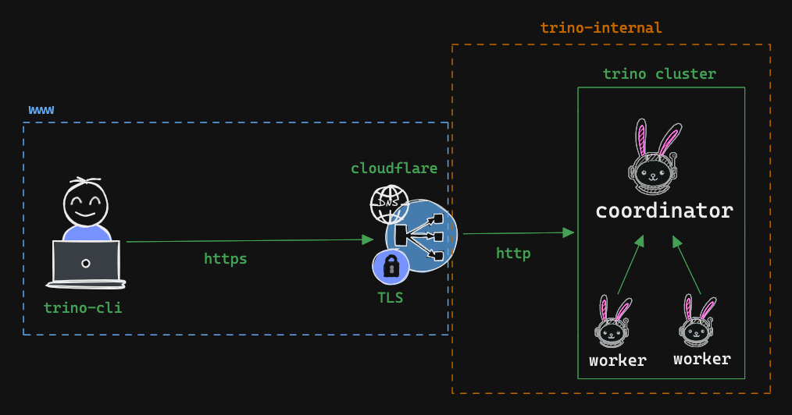
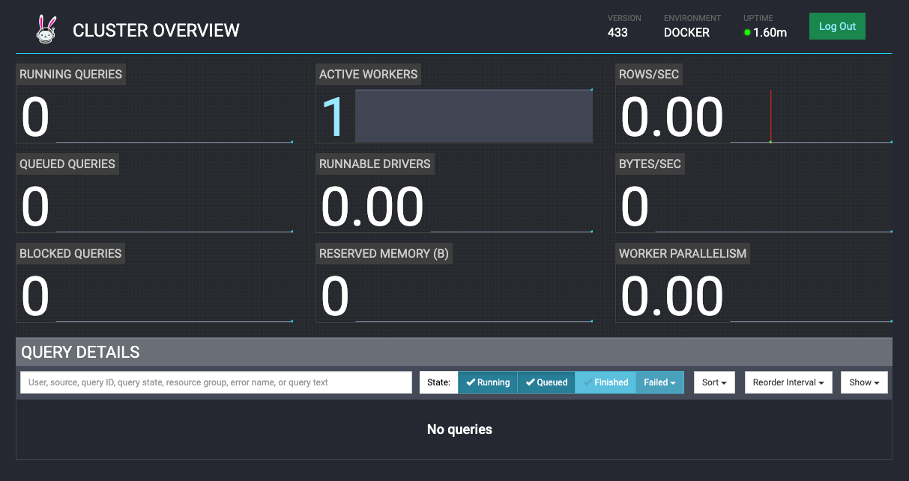
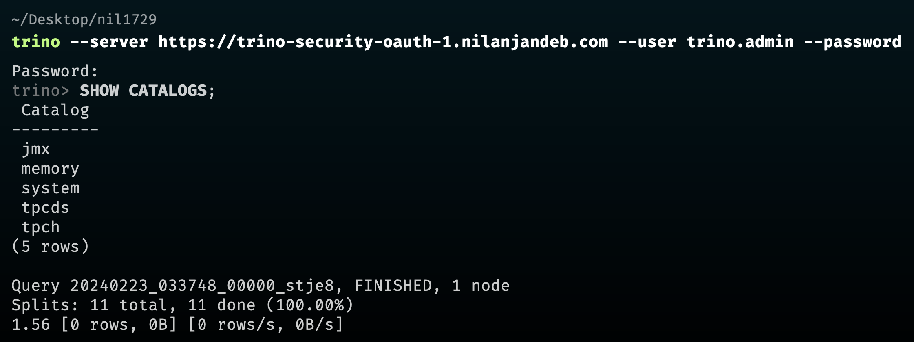
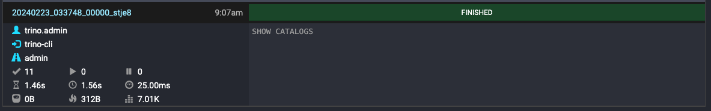
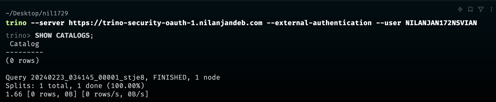
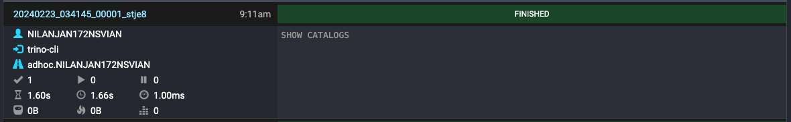
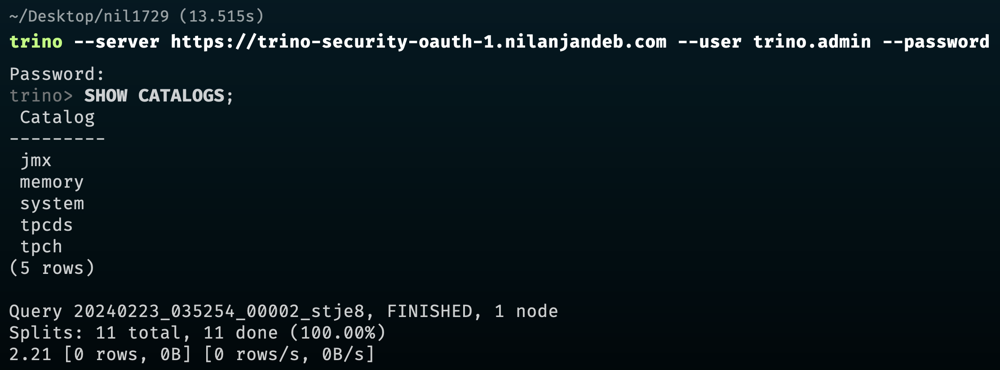
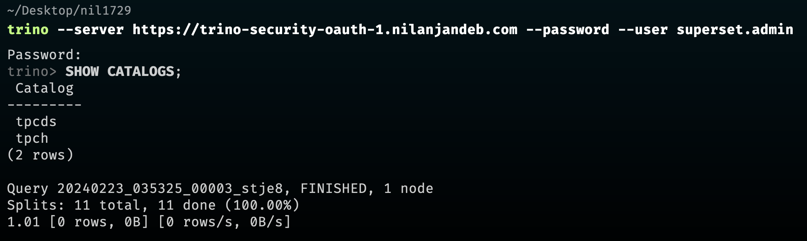
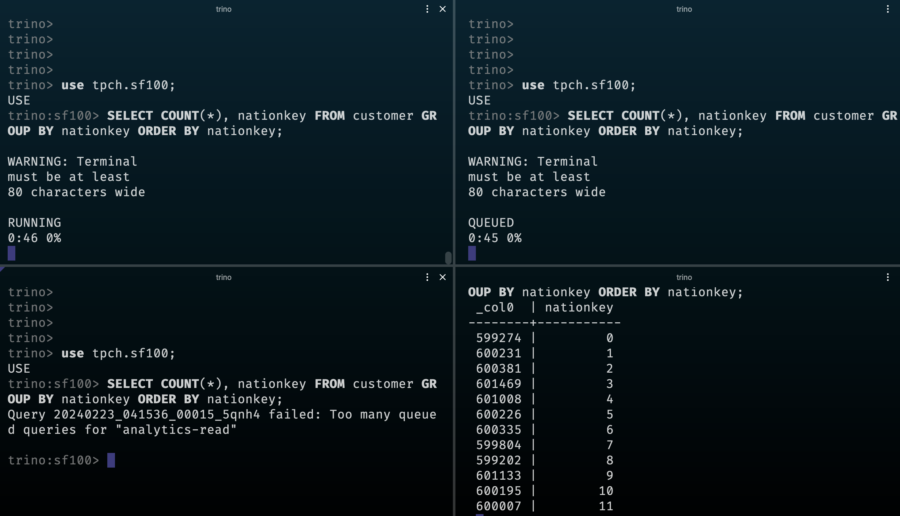
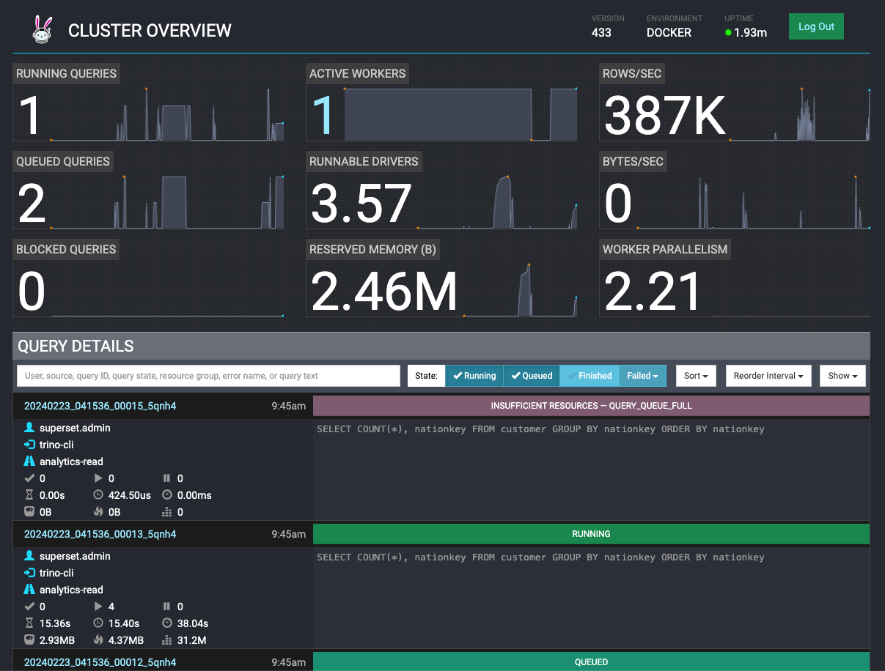

## Trino Resource Management

This github repository basically extension of [Trino Security - OAuth](https://github.com/nil1729/trino-security-oauth) and [Trino Security - Password Authentication](https://github.com/nil1729/trino-security-demo). Here I have provided a simple example of User Mapping, User Groups, and Resource Management in Trino.

### Considerations

- To configure security on Trino cluster, it's mandatory to enable TLS/HTTPS.
- I will be using `Cloudflare Tunnel` to expose Trino cluster to the internet. `Google OAuth` and `PASSWORD` method will be used for authentication.

### Trino Security Architecture (Docker)



### Running Trino Cluster locally

#### Prerequisites

- Cloudflare Tunnel. Please follow the steps mentioned [here](https://youtu.be/ey4u7OUAF3c) by NetworkChuck on YouTube. Get a `cloudflare access token` from Zero Trust.

- Google OAuth Client ID and Secret. Please follow this [guide](https://developers.google.com/identity/protocols/oauth2/web-server).

- Please create a `.env` file and put the variables mentioned in `.env.sample` file.

#### Running Trino Cluster with Docker Compose

```bash
docker-compose up -d
```

#### Check Trino Web UI

You must have to login with your Google Account.



For this exercise, I have used pattern user mapping for PASSWORD authentication and file user mapping for OAuth2 authentication.

#### User Mapping (OAuth)

```json
{
  "rules": [
    {
      "pattern": "nilanjan1729nsvian@gmail.com",
      "allow": false
    },
    {
      "pattern": "(?<user>.+)@(?<campus>.+).bits-pilani.ac.in",
      "user": "${user}_${campus}",
      "case": "upper"
    },
    {
      "pattern": "(.*)@gmail.com",
      "case": "upper"
    }
  ]
}
```

With the Above User Mapping Rules, the following things will happen:

1. I can login with any `@gmail.com` account except `nilanjan1729nsvian@gmail.com`. The OAuth2 user will be mapped to `UPPERCASE` username. [Read More](https://trino.io/docs/current/security/user-mapping.html#file-mapping-rules)

2. I can login with any `@bits-pilani.ac.in` account. The OAuth2 user will be mapped to `UPPERCASE` username and campus name will be appended with the username. For example, `username@pilani.bits-pilani.ac.in` will be mapped to `USERNAME_PILANI`.

3. I can't login with any other GSuite business account because there have no mapping for those email ids.

#### User Mapping (PASSWORD)

```properties
http-server.authentication.password.user-mapping.pattern=^(trino\..*|superset\..*|nilanjan\..*)
```

1. This pattern will allow only `trino.*`, `superset.*`, and `nilanjan.*` users to login with PASSWORD authentication. [Read More](https://trino.io/docs/current/security/user-mapping.html#pattern-mapping-rule)

2. The registered users list can be found in `extra-config/password.db` file. The password is `password` for all users.

#### Testing User Mapping with Trino CLI

##### PASSWORD Authentication

```bash
trino --server https://{{cloudflare-tunnel-url}} --user trino.admin --password
```





##### OAuth Authentication

Now, Let's login with any `@gmail.com` account.

```bash
trino --server https://{{cloudflare-tunnel-url}} --external-authentication --user NILANJAN172NSVIAN
```





N.B. Here for the user `NILANJAN172NSVIAN` don't have any access to any catalog. So, it's showing zero catalogs.

#### User Groups

By using group configuration we can manage access control or trino resources more effectively. Please follow official documentation for more details. [Read More](https://trino.io/docs/current/security/group-file.html)

```txt
etl:trino.etl
analytics:superset.admin
finance:F20190013P_ALUMNI
adhoc:NILANJAN172NSVIAN,trino.headless
```

#### Access Control

By configuring groups on the last step, we can now configure access control for different groups. Please follow official documentation for File Based Access Control. [Read More](https://trino.io/docs/current/security/file-system-access-control.html)

```json
{
  "catalogs": [
    {
      "group": "finance",
      "catalog": "tpch",
      "allow": true
    },
    {
      "group": "analytics|etl",
      "catalog": "tpcds|tpch",
      "allow": true
    },
    {
      "user": "trino.admin",
      "catalog": ".*",
      "allow": "all"
    },
    {
      "catalog": "system",
      "allow": "none"
    }
  ]
}
```

For the sake of simplicity, I have used `tpch` and `tpcds` catalogs and only setup catalog level access control.

#### Access Control in Action

```bash
trino --server https://{{cloudflare-tunnel-url}} --user trino.admin --password
```



```bash
trino --server https://{{cloudflare-tunnel-url}} --user superset.admin --password
```



#### Resource Groups

By configuring resource groups, We can manage cpu or memory allocation, query concurrency for different types of workloads on Trino Cluster. Please follow official documentation for more details. [Read More](https://trino.io/docs/current/admin/resource-groups.html)

```json
{
  "rootGroups": [
    {
      "name": "admin",
      "softMemoryLimit": "100%",
      "hardConcurrencyLimit": 5,
      "maxQueued": 5,
      "schedulingPolicy": "query_priority",
      "jmxExport": false
    },
    {
      "name": "etl",
      "softMemoryLimit": "100%",
      "hardConcurrencyLimit": 10,
      "maxQueued": 10,
      "jmxExport": false
    },
    {
      "name": "analytics-read",
      "softMemoryLimit": "100%",
      "hardConcurrencyLimit": 1,
      "maxQueued": 2,
      "jmxExport": true
    },
    {
      "name": "analytics-stat",
      "softMemoryLimit": "100%",
      "hardConcurrencyLimit": 1,
      "maxQueued": 1
    },
    {
      "name": "analytics-all",
      "softMemoryLimit": "100%",
      "hardConcurrencyLimit": 3,
      "maxQueued": 10
    },
    {
      "name": "finance",
      "softMemoryLimit": "100%",
      "hardConcurrencyLimit": 3,
      "maxQueued": 3,
      "jmxExport": true,
      "subGroups": [
        {
          "name": "${USER}",
          "softMemoryLimit": "10%",
          "hardConcurrencyLimit": 2,
          "maxQueued": 2
        }
      ]
    },
    {
      "name": "adhoc",
      "softMemoryLimit": "100%",
      "hardConcurrencyLimit": 5,
      "maxQueued": 5,
      "jmxExport": true,
      "subGroups": [
        {
          "name": "${USER}",
          "softMemoryLimit": "10%",
          "hardConcurrencyLimit": 2,
          "maxQueued": 2
        },
        {
          "name": "other",
          "softMemoryLimit": "10%",
          "hardConcurrencyLimit": 3,
          "maxQueued": 3,
          "subGroups": [
            {
              "name": "${USER}",
              "softMemoryLimit": "10%",
              "hardConcurrencyLimit": 2,
              "maxQueued": 2
            }
          ]
        }
      ]
    }
  ],
  "selectors": [
    {
      "user": "trino.admin",
      "group": "admin"
    },
    {
      "userGroup": "etl",
      "group": "etl"
    },
    {
      "userGroup": "analytics",
      "queryType": "SELECT",
      "group": "analytics-read"
    },
    {
      "userGroup": "analytics",
      "queryType": "EXPLAIN",
      "group": "analytics-stat"
    },
    {
      "userGroup": "analytics",
      "group": "analytics-all"
    },
    {
      "userGroup": "finance",
      "group": "finance.${USER}"
    },
    {
      "source": "trino-cli",
      "group": "adhoc.${USER}"
    },
    {
      "group": "adhoc.other.${USER}"
    }
  ],
  "cpuQuotaPeriod": "1h"
}
```





---

### Recommended Reading

- [Trino Security - User Mapping](https://trino.io/docs/current/security/user-mapping.html)
- [Trino Security - Group Provider](https://trino.io/docs/current/security/group-file.html)
- [Trino Security - File Based Access Control](https://trino.io/docs/current/security/file-system-access-control.html)
- [Trino Administration - Resource Groups](https://trino.io/docs/current/admin/resource-groups.html)

---

Made with ❤️ by [nil1729](https://github.com/nil1729)
